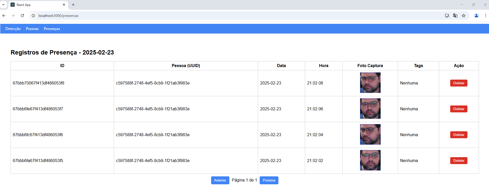

# FacePresenceTracker - Projeto Full-Stack

Este projeto é uma aplicação de reconhecimento facial que utiliza webcam para capturar imagens, detectar faces e registrá-las no backend. A aplicação está dividida em dois diretórios principais:

- **frontend/**: Contém o aplicativo React que gerencia a captura e a visualização em tempo real.
- **backend/**: Contém o serviço FastAPI que processa as imagens, realiza o reconhecimento (usando a biblioteca DeepFace) e gerencia o armazenamento dos registros e presenças em um banco de dados MongoDB.

---

## Funcionalidades Gerais

- **Detecção Facial em Tempo Real:**  
  O frontend utiliza a biblioteca [MediaPipe Face Detection](https://github.com/google/mediapipe) para capturar e detectar faces em tempo real a partir da webcam.

- **Reconhecimento e Cadastro:**  
  Ao detectar uma face, o backend utiliza o [DeepFace](https://github.com/serengil/deepface) para comparar a face capturada com as faces já cadastradas. Se a face for reconhecida, ela é associada à pessoa existente; caso contrário, uma nova pessoa é criada.

- **Registro de Presença:**  
  Cada vez que uma face é reconhecida ou cadastrada, o backend registra uma presença contendo a data, hora, UUID da pessoa, caminho da foto capturada e as tags associadas.

- **Gestão de Pessoas e Presenças:**  
  O backend disponibiliza rotas para:
  - Listar pessoas cadastradas (com paginação);
  - Visualizar os detalhes (tags, foto primária) de uma pessoa;
  - Adicionar e remover tags de uma pessoa;
  - Listar as fotos de uma pessoa (com opção de remoção individual);
  - Listar e deletar registros de presença filtrados pela data atual (tabela paginada).

---

## Screenshots e Exemplo de Telas

- **Tela de Detecção Facial**  
    
  *A tela principal mostra o feed da webcam com retângulos sobre as faces detectadas.*

- **Listagem de Pessoas**  
    
  *A tela de pessoas exibe cartões com a foto primária, UUID e tags.*

- **Registro de Presença**  
    
  *A tabela de presença mostra os registros filtrados pela data atual com opções de paginação e exclusão.*

---

## Bibliotecas e Tecnologias Utilizadas

### Frontend
- **React**: Biblioteca para construção de interfaces.
- **MediaPipe Face Detection**: Utilizada para detecção de faces.
- **Camera Utils (MediaPipe)**: Facilita a integração com a webcam.
- **React Router**: Para gerenciamento de rotas na aplicação.
- **React Modal**: Para exibição de modais (ex.: listagem de fotos).

### Backend
- **FastAPI**: Framework para criação de APIs REST de alta performance.
- **DeepFace**: Biblioteca para reconhecimento facial (usando modelos como Facenet512).
- **MongoDB**: Banco de dados NoSQL para armazenamento dos registros de pessoas e presenças.
- **PIL (Pillow)**: Para processamento de imagens.
- **Uvicorn**: Servidor ASGI para rodar o FastAPI.
- **Shutil**: Para operações de sistema (exclusão de pastas).

---

## Instruções para Rodar o Projeto

### Pré-requisitos

- [Node.js](https://nodejs.org/) instalado (para o frontend).
- [Python 3.8+](https://www.python.org/) instalado (para o backend).
- [MongoDB](https://www.mongodb.com/) instalado e rodando.
- (Opcional) Ambiente virtual Python configurado.

### Frontend

1. Navegue até a pasta `frontend`:
   ```
   bash
   ```
   ```
   cd frontend
   ```
3. Instale as dependências:
   ```
   npm install
   ```
5. Inicie o servidor de desenvolvimento:
   ```
   npm start
   ```
  O aplicativo React estará disponível geralmente em http://localhost:3000.

### Backend
1. Navegue até a pasta backend:
   ```
   cd backend
   ```
3. Crie e ative um ambiente virtual (opcional, mas recomendado):
   ```
   python -m venv .venv
   ```
   ```
   source .venv/bin/activate    # No Linux/Mac
   ```
   ```
   .\.venv\Scripts\activate     # No Windows
   ```
5. Instale as dependências (verifique o arquivo requirements.txt):
   ```
   pip install -r requirements.txt
   ```
7. Inicie o servidor FastAPI com Uvicorn:
   ```
   python -m uvicorn server:app --reload --host 0.0.0.0 --port 8000
   ```
   A API estará disponível em http://localhost:8000.
   
---
<!-- 
## Melhorias Futuras

1. Autenticação e Autorização:
Implementar uma camada de autenticação (por exemplo, com JWT) para proteger as rotas de API e gerenciar usuários.

2. Armazenamento de Imagens em MinIO:
Em vez de salvar imagens no sistema de arquivos local, integrar com MinIO para armazenamento de objetos, melhorando escalabilidade e gerenciamento.

3. Integração com Kafka:
Utilizar Kafka para criar um pipeline de processamento de eventos, o que pode ser útil para processamento em tempo real, auditoria e escalabilidade.

4. Otimizações de Processamento:
Melhorar a lógica de detecção e reconhecimento para reduzir falsos positivos.
Cache de modelos e resultados para diminuir a latência nas comparações.
Interface do Usuário e Experiência (UX):

5. Melhorar a UI do frontend, utilizando frameworks de design (como Material-UI ou Tailwind CSS).
Adicionar gráficos e estatísticas sobre a presença e reconhecimento ao longo do tempo.

7. Monitoramento e Log:
Implementar uma camada de monitoramento (por exemplo, com Prometheus/Grafana) e log centralizado para facilitar a manutenção e a detecção de falhas.

8. Testes Automatizados:
Desenvolver uma suíte de testes (unitários e de integração) para ambas as camadas (frontend e backend) garantindo a estabilidade do sistema.

-->